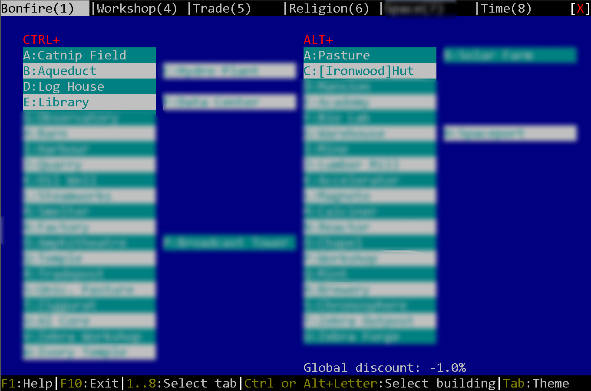
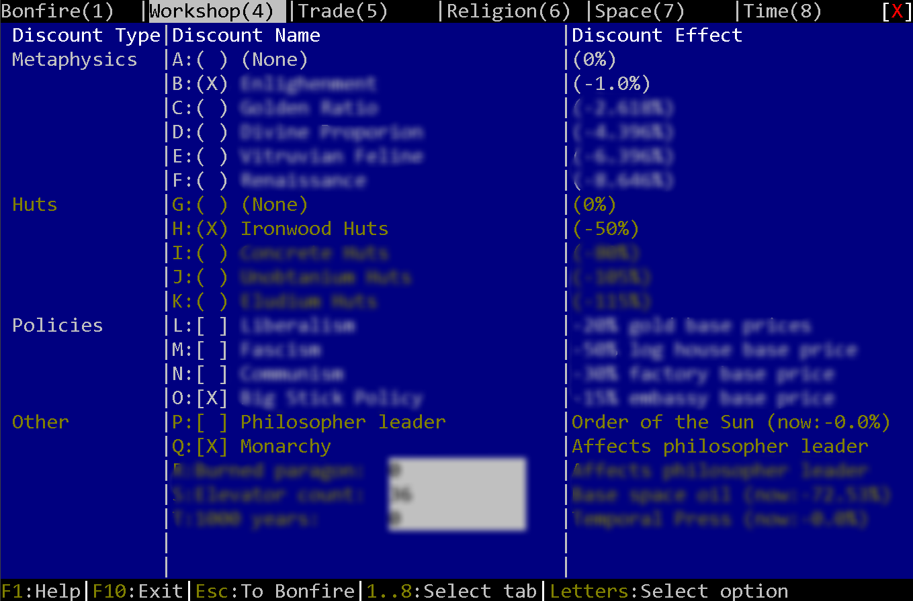
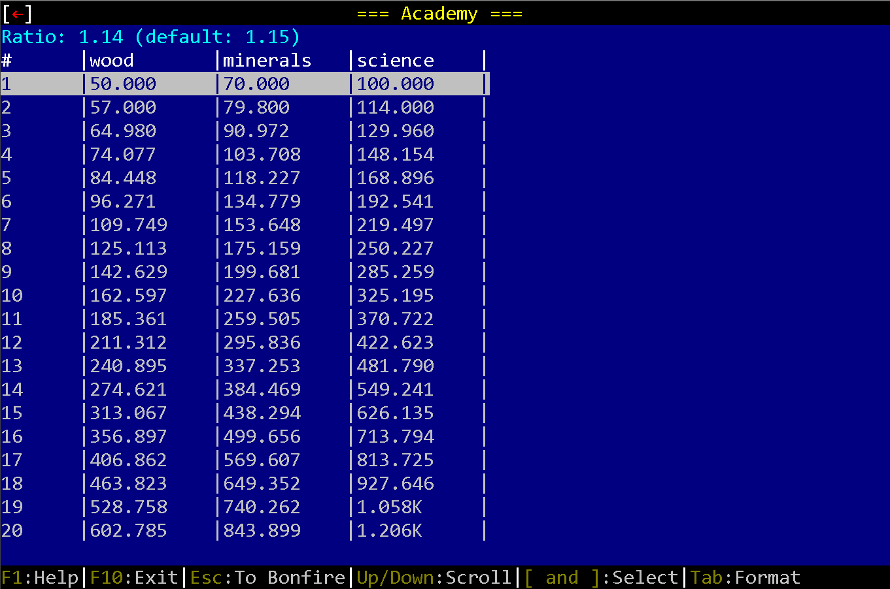
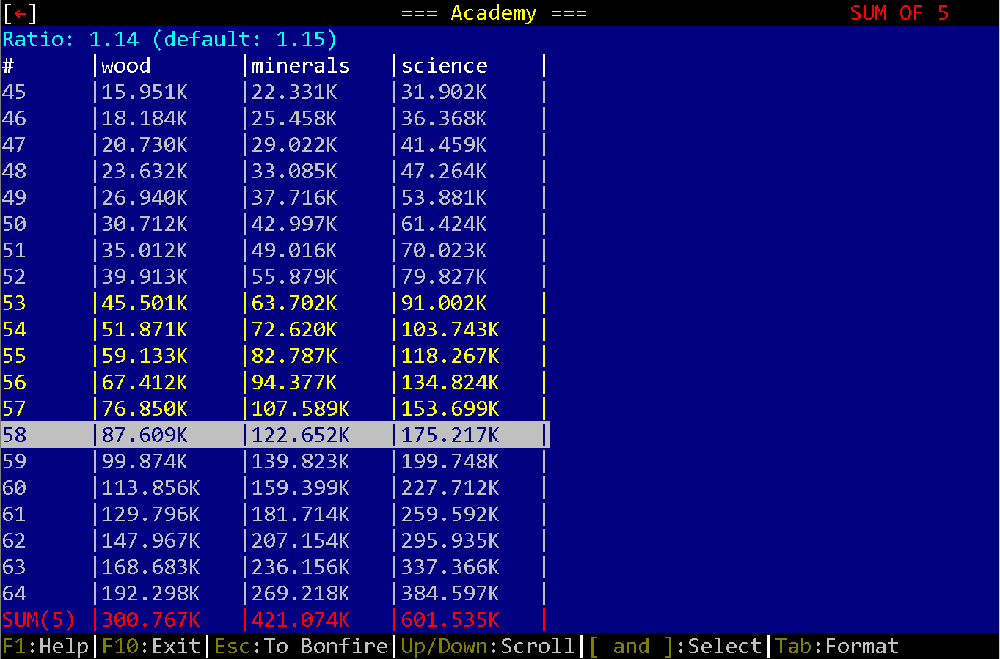

# KGBC: Kittens Game Buildings Calculator

## What is it?

First, you must know, what Kittens Game is. If you do not, please refer to https://kittensgame.com/ui/ .

In this game every building costs you more and more resources. I was tired of making Excel tables, so I decided to make an utility that will show cost of any amount of any building in the game.

Also, it shows total amount of resources required to build a series of N buildings, for example, wood needed to build 3rd, 4th and 5th Log Houses.

This program shows every building in the game, so you will be spoiled if you use it. In this README file I intentionally blurred most of screenshots so unspoiled player will see only minor spoilers from first several hours of playthrough.

## Interface

This is a text mode application written with curses library. Interface is similar to original KG, but have completely different purpose. You can use this application both with keyboard and mouse. Thanks to curses library, each button, checkbox and edit field are clickable.

First thing you'll see when you start application will be *spoiler warning window*. You cannot close it simply by using Esc or Spacebar. You must hit F4. This warning can be disabled by pressing F7 before pressing F4.

Then you'll see the Bonfire tab. You can select buildings immediately:

However, in most cases you'll want to set up desired discounts. To do that please go to Workshop tab:

Please note, that settings of Workshop tab are saved to disk, so you don't need to change it every time.

After that, you can switch to any tab and select any building. You'll see a table of resources, required to create buildings from 1 to 20:

You can scroll it, or you can use [ and ] keys to select several buildings (only subsequent buildings are allowed). In bottom line you'll see total resourses required for selected buildings:

## System requirements

- Linux or Windows
- Python 3.8+ 32-bit or 64-bit
- windows-curses for Windows. Linux already have curses package preinstalled.
- esprima (optional). If you don't have that, you can use program as normal, but database rebuilding will be disabled (this is a debug feature though).
- It works on terminals of size 80x25 or greater. 80x24 is insufficient!

Program have PyInstaller binaries, so you can just download it and run.

## License

MIT. See LICENSE file for details.